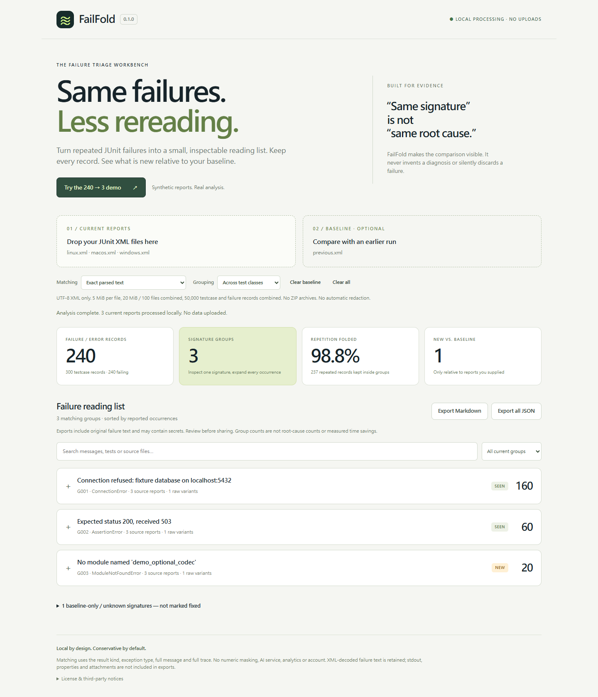

# FailFold
### Same failures. Less rereading.

Fold matching failure records from local JUnit XML reports into an evidence-preserving reading list. Compare a supplied baseline, inspect every source occurrence, and export Markdown or JSON. Browser and Node CLI use the **same parser and grouping engine**.

**[Live demo](https://billy30183-rgb.github.io/failfold/) · [GitHub](https://github.com/billy30183-rgb/failfold)**

Public static site verified on 2026-09-20. No npm package is published.

[繁體中文快速開始](START_HERE.zh-TW.md) · [Verification](docs/VERIFICATION.md) · [Windows verification](docs/WINDOWS-VERIFICATION.md) · [Security](SECURITY.md) · [Compatibility](docs/COMPATIBILITY.md)



## Try the included demo

Open `dist/index.html` in a browser and select **Try the 240 → 3 demo**. The bundle is a single HTML file with no remote scripts, fonts, services, analytics, account or API key. Actual file URL navigation and loopback HTTP navigation both passed on Windows Edge 153.

A loopback-only alternative, from the project directory with Python 3 installed:

```sh
python -m http.server 8000 --bind 127.0.0.1 --directory dist
```

Then open `http://127.0.0.1:8000/`. Only the `dist` directory is served; selected reports are read by your browser, not sent to this server. Managed browser policies can still prevent local navigation.

The **synthetic** demo contains 300 current testcase records: 240 failing, 50 passing and 10 skipped. Its 240 failure records fold into three identical-signature groups (160, 60 and 20 occurrences). Relative to the supplied synthetic baseline, two groups are seen and one is new; one baseline group is not observed now.

**98.75% fewer top-level reading entries is not 98.75% less debugging time.** All 240 failure records remain available, and matching signatures do not prove one shared root cause. No human time-savings study or real adoption claim is included.

## Use your reports

Select one or more UTF-8 JUnit XML files as **Current reports**. Optionally select previous-run reports as the baseline. Analysis starts automatically whenever reports or grouping options change; there is no separate Analyze button. Leave **Exact** mode enabled first. The browser worker is cancellable and has a 15-second analysis timeout. Search by message, trace, testcase or source. Expand a group to inspect each original failure record; large lists are paginated. Downloads include all records, not only the visible page.

Choose reports representing a comparable test scope and environment. The tool does not fetch CI artifacts, run tests, identify retries or infer why the build failed. Exports may contain secrets: review them before sharing.

## Node CLI

Requires Node.js 22 or newer. No npm package download is needed: `@xmldom/xmldom` 0.9.12 is vendored with its MIT license. Python/Playwright are **development-only** browser-test dependencies.

```sh
node src/cli.js examples/current --baseline examples/baseline --output report.md --json report.json
node src/cli.js ./test-results --baseline ./previous-results --fail-on-new --output new-failures.md
node src/cli.js ./test-results --fail-on-failure --output all-failures.md
node src/cli.js --help
```

Directories are scanned recursively for `.xml` files. Only supply report directories, not an entire repository. Supply `--baseline PATH` repeatedly for multiple inputs. Quote paths containing spaces. `--` ends option parsing for positional filenames beginning with a hyphen.

| Exit code | Meaning |
| --- | --- |
| 0 | Analysis completed; any selected gate passed. Without a gate, failures may still exist. |
| 1 | `--fail-on-new` found a new signature, or `--fail-on-failure` found any current failure. |
| 2 | Invalid input or processing error; the new-signature gate also returns 2 for warnings or uninformative evidence. |

`--fail-on-new` requires a baseline. **It is not a test-regression gate**: a newly failing testcase can share an already-seen signature. Keep the original test command's exit status in CI. Output files are not overwritten unless `--force` is explicit; input files must never be output targets. Multiple output writes are not a single atomic transaction.

## What grouping means

Exact mode compares XML-decoded result kind, error type, message and full trace. Optional `--scope class` additionally requires identical test classnames. Default grouping can combine matching records across different test names and report files.

Opt-in `--mode formatting` only strips ANSI SGR color codes, trailing line whitespace and outer blank lines, and normalizes line endings. It preserves raw variants and does **not** remove paths, numbers, HTTP codes, timestamps or stack line numbers. Consequently, equivalent errors whose paths differ can remain separate. That is a deliberate conservative trade-off.

Blank message-and-trace errors remain separate and have **unknown** status. A type name alone is insufficient grouping evidence. Labels mean:

- **New / seen:** the informative signature is absent / present in the supplied baseline only.
- **Not observed:** a baseline signature was not found in the selected current reports; this does not mean fixed.
- **Uncompared / unknown:** no baseline / insufficient message-and-trace evidence.

Group IDs are display labels, not persistent identifiers. Counts represent reported occurrences, not globally unique tests. Identical XML contents under different filenames are counted twice with a warning, because they can represent separate CI jobs or duplicate downloads.

## Limits and compatibility

At most 100 combined current/baseline files, 5 MiB per file, 20 MiB total, 50,000 testcase records and 50,000 failure/error records. XML element/depth limits are also enforced. UTF-8 only. Common `testsuite`, `testsuites`, `testcase`, `failure`, `error`, `skipped`, nesting, namespace prefixes and CDATA are supported. Malformed XML, DTD declarations, unsupported retry extensions and incomplete failure summaries are rejected rather than presented as successful tests.

JUnit XML has exporter variations rather than one universal official schema. See [compatibility scope and sources](docs/COMPATIBILITY.md). Exporter families not exercised with actual output are not claimed fully compatible.

Original failure records retain XML-decoded text and selected source/test metadata, not a byte-for-byte archive of the full XML. `system-out`, properties, screenshots and attachments are not exported.

## Development and verification

```sh
npm test
npm run build
npm run benchmark
```

Browser tests (network needed to install development tools, not to analyze reports):

```sh
python -m pip install -r requirements-dev.txt
python -m playwright install chromium
npm run test:browser
```

`PLAYWRIGHT_CHROMIUM_EXECUTABLE` optionally selects an installed Chromium. `LIVE_URL` optionally selects an authorized deployed page for navigation acceptance. Normal tests navigate first, then disable network. `FAILFOLD_IN_MEMORY_TEST=1` is an explicit restricted-environment fallback, **not** evidence that file, HTTP or deployed navigation works.

The current Windows results show **73 Node tests passed** and **17 HTTP browser acceptance checks passed** with Microsoft Edge 153 through Playwright 1.57; browser/CLI demo exports agree. A separate 17-check run also passed through actual file URL navigation. See the new [Windows verification record](docs/WINDOWS-VERIFICATION.md); the earlier [verification record](docs/VERIFICATION.md) remains historical context. Windows/Linux CI and Chromium acceptance passed before deployment. The public Pages site also passed all 17 navigation acceptance checks; see [publication verification](docs/PUBLICATION-VERIFICATION.md).

`npm run build` rebuilds the single HTML file and synthetic demo fixtures deterministically from checked-in source. `npm run benchmark` records a synthetic 10,000-failure parse/group benchmark; timings vary by host and exclude human triage.

## Project scope

This is not an AI diagnosis service, retry/flaky detector, log uploader, full test dashboard or security-certified parser. It is a small local tool for repeated failure reading. Existing tools already categorize test failures; [positioning](docs/COMPARISON.md) explains this project's narrower choices without a novelty or superiority claim.

## License

MIT for original FailFold code. Vendored `@xmldom/xmldom` 0.9.12 is also MIT; retain its original notices. See [third-party notices](THIRD_PARTY_NOTICES.md). The npm package is intentionally private until publication is separately authorized and naming/dependency review is complete.
